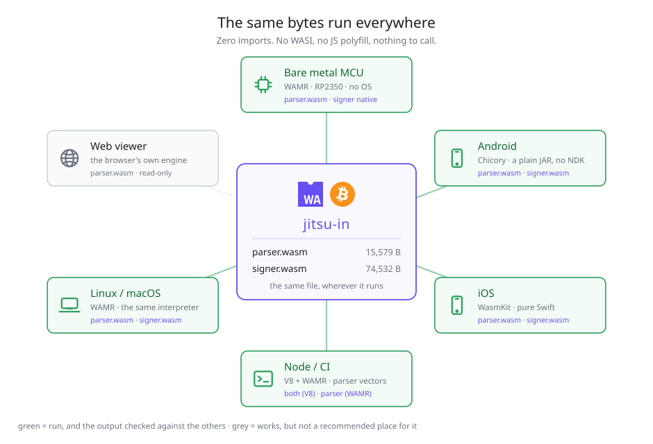
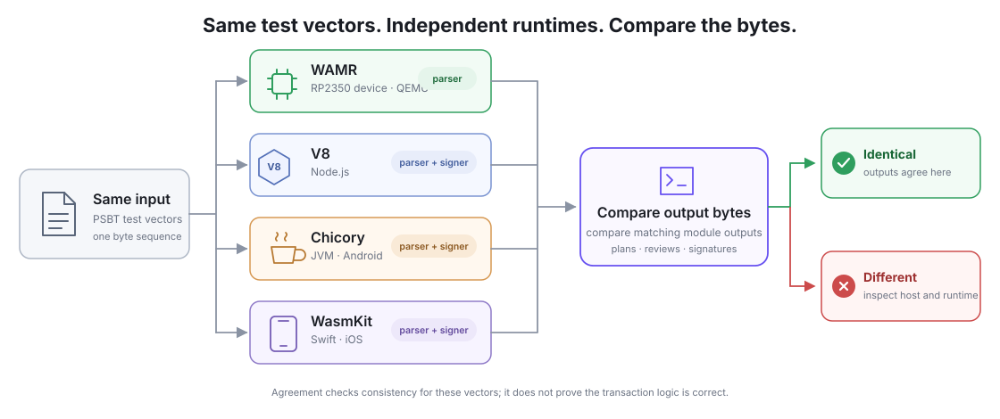

# The same bytes, everywhere

The parser reads the transaction and builds a plan. The signer checks that plan, prepares the details
for review, and signs it. The table below lists the runtimes where these modules have been run and
their output compared.

The module convention is in [module-abi.md](module-abi.md); how to drive each one is in
[../parser/docs/abi.md](../parser/docs/abi.md) and [../signer/docs/abi.md](../signer/docs/abi.md).

## What "the same" means

Two modules, neither with a single import. No WASI, no JS polyfill, no clock, no allocator — nothing
whose behaviour could differ with where the module was put.

| | size | imports | what it does |
|---|---:|---:|---|
| `parser.wasm` | 15,579 B | 0 | UR reassembly, PSBT parsing, building the plan, taking signatures back, UR encoding |
| `signer.wasm` | 74,416 B | 0 | BIP39 seed, SeedQR, BIP32 derivation, re-checking a plan, ECDSA and Schnorr signing, xpub export |

`make everywhere` redraws it (`tools/draw_everywhere.mjs`).

## Where they have actually been run

Green on the figure means the module was run there and its output checked against the other
platforms — not that the path looks like it should work. *The device* is the RP2350 hardware signer
these modules were first written for, a separate project that is not public.

| | runtime | what runs as WebAssembly |
|---|---|---|
| Bare metal MCU (RP2350) | WAMR classic interpreter, no OS | `parser.wasm`. **The signer is native C** — the device links it rather than interpreting it |
| Android | Chicory, a plain JAR: no JNI, no NDK, no `.so` per ABI | both |
| iOS | WasmKit, pure Swift | both |
| Node | V8 — both modules, fuzzing and Bitcoin Core comparison; WAMR classic — parser vectors and signer tests (`make check-wamr`) | both, in V8 and in WAMR |
| Linux / macOS | WAMR, the same interpreter the device uses | both (`make check-wamr`) |
| Web viewer | whatever engine the browser has | `parser.wasm`. **No keys in the browser**, so nothing signs |

On the microcontroller, WAMR interprets **the exact `parser.wasm` file built by this repository**.
The device does not use a separate compilation of the parser.

## Comparing runtimes

Give each runtime the same test vectors and compare the output bytes. A difference is a reason to
check the runtime, host library, and module behavior:

This comparison has caught a runtime bug. An
[unaligned `i64.store` in WAMR](https://github.com/wasm-micro-runtime/wasm-micro-runtime/pull/5123)
showed up only on the real hardware — QEMU did not reproduce it — and having V8 as a second opinion
is what made it clear the parser was not at fault.

The same argument runs one level down, inside this repository: `parser.wasm` exists twice, in C and
in Rust, and `make check-rust-plan` requires both to return the same plan for every vector and for
20,000 mutated PSBTs. See [../parser/BENCHMARK.md](../parser/BENCHMARK.md).

## What this does not give you

- **It is not an audit.** Running the same bytes in six places shows they agree, not that they are
  right. What they are checked *against* is Bitcoin Core: 37 PSBTs agree on the parse and 8
  signatures come back byte-identical
- **A browser is not a safe place for keys**, which is why the web page only reads
- **Zero imports is a property of these two modules**, not of anything else in a product built on
  them. The camera, the screen and the storage are all outside
