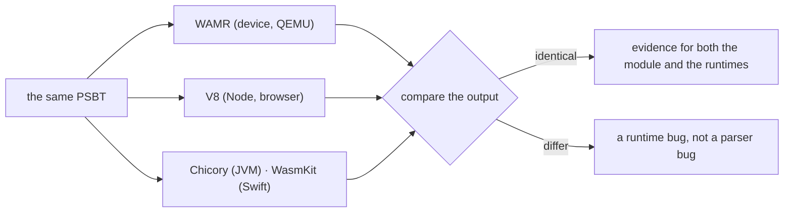

# The same bytes, everywhere

**The part that reads the transaction is separated from the part that holds the keys, and the first
one is a file you can run anywhere.** So what a signer shows you before you approve it is something
you can reproduce yourself, on hardware you already own, and compare.

The module convention is in [module-abi.md](module-abi.md); how to drive each one is in
[../parser/docs/abi.md](../parser/docs/abi.md) and [../signer/docs/abi.md](../signer/docs/abi.md).

## What "the same" means

Two modules, neither with a single import. No WASI, no JS polyfill, no clock, no allocator — nothing
whose behaviour could differ with where the module was put.

| | size | imports | what it does |
|---|---:|---:|---|
| `parser.wasm` | 15,570 B | 0 | UR reassembly, PSBT parsing, building the plan, taking signatures back, UR encoding |
| `signer.wasm` | 56,522 B | 0 | BIP39 seed, BIP32 derivation, re-checking a plan, ECDSA and Schnorr signing, xpub export |

`make everywhere` redraws it (`tools/draw_everywhere.mjs`).

## Where they have actually been run

Green on the figure means the module was run there and its output checked against the other
platforms — not that the path looks like it should work.

| | runtime | what runs as WebAssembly |
|---|---|---|
| Bare metal MCU (RP2350) | WAMR classic interpreter, no OS | `parser.wasm`. **The signer is native C** — the device links it rather than interpreting it |
| Android | Chicory, a plain JAR: no JNI, no NDK, no `.so` per ABI | both |
| iOS | WasmKit, pure Swift | both |
| Node | V8 — the vectors, the fuzzing and the Bitcoin Core comparison run here | both |
| Linux / macOS | WAMR, the same interpreter the device uses | both |
| Web viewer | whatever engine the browser has | `parser.wasm`. **No keys in the browser**, so nothing signs |

The device row is the one worth reading twice: `parser.wasm` on the microcontroller is
**byte-for-byte the file this repository builds**, interpreted by WAMR. It is not a recompilation.

## Why more than one runtime is a feature, not a cost

Several runtimes given the same input must produce the same bytes out. When they do not, the
disagreement localises the bug:

This has already paid for itself once. An
[unaligned `i64.store` in WAMR](https://github.com/wasm-micro-runtime/wasm-micro-runtime/pull/5123)
showed up only on the real hardware — QEMU did not reproduce it — and having V8 as a second opinion
is what made it clear the parser was not at fault.

The same argument runs one level down, inside this repository: `parser.wasm` exists twice, in C and
in Rust, and `make check-rust-plan` requires both to return the same plan for every vector and for
20,000 mutated PSBTs. See [../parser/BENCHMARK.md](../parser/BENCHMARK.md).

## What this does not give you

- **It is not an audit.** Running the same bytes in six places shows they agree, not that they are
  right. What they are checked *against* is Bitcoin Core: 37 PSBTs agree on the parse and 8
  signatures come back byte-identical
- **A browser is not a safe place for keys**, which is why the web page only reads
- **Zero imports is a property of these two modules**, not of anything else in a product built on
  them. The camera, the screen and the storage are all outside
